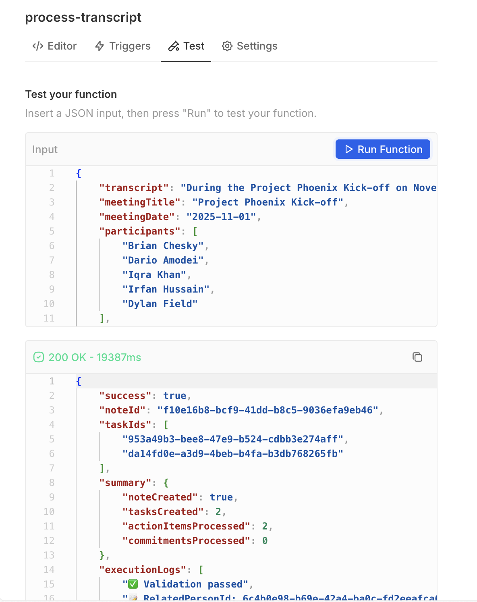

## 🧠 AI-Powered Meeting Transcript to CRM Data Integration

---

### Overview

This feature automatically transforms meeting transcripts into structured CRM data using AI.  
When unstructured meeting notes are received via a **webhook**, the system processes them and creates organized **notes, tasks, and assignments** directly in Twenty CRM.

---

### Key Features

- 🤖 **AI-Powered Analysis:**  
  Extracts summaries, action items, assignees, and due dates from natural language transcripts.

- 🗂 **Smart Task Consolidation:**  
  Merges related sub-tasks into unified deliverables  
  _(e.g., `"draft"` + `"review"` + `"present"` → one consolidated task)._

- 🧑‍🤝‍🧑 **Intelligent Assignment:**  
  Uses GraphQL member lookup to match extracted assignee names to workspace member IDs with flexible string matching.

- 🔗 **Automatic Linking:**  
  Links generated **notes** and **tasks** to relevant contacts using `noteTargets` and `taskTargets`.

- 📅 **Date Parsing:**  
  Converts relative date expressions (e.g., “next Monday”, “end of week”) into **ISO-formatted dates** for accurate scheduling.

---

### Technical Stack

| Component | Description |
|----------|-------------|
| **AI Provider** | Groq (via OpenAI SDK) using the `GPT-OSS-20B` model |
| **APIs** | Twenty CRM REST API + GraphQL (for member resolution) |
| **Runtime** | Webhook-triggered serverless function written in **TypeScript** |

---

### Example Input

```json
{
  "transcript": "During the Project Phoenix Kick-off on November 1st, 2025, we discussed securing the Series B funding. ACTION: Dylan Field is designated to finalize the investor deck layout and needs to present it next Monday, November 4th. Irfan Hussain will review the deck before the presentation by Monday morning. COMMITMENT: Dario Amodei confirmed he would personally review the security protocols for the AI model before the end of this week, by Friday November 7th. Iqra Khan will coordinate the security review process and ensure completion by the Friday deadline.",
  "meetingTitle": "Project Phoenix Kick-off",
  "meetingDate": "2025-11-01",
  "participants": [
    "Brian Chesky",
    "Dario Amodei",
    "Iqra Khan",
    "Irfan Hussain",
    "Dylan Field"
  ],
  "token": "e6d9d54e51953fd5a451cca933c63e7f8783b001f0c45be95be9d09ee06c6cda",
  "relatedPersonId": "6c4b0e98-b69e-42a4-ba0c-fd2eeafca642"
}
```


### Example Output

```json
{
  "success": true,
  "noteId": "9cc3b4fc-ae37-4b3e-a343-a4c69cf6b1e8",
  "taskIds": [
    "0f408062-0dcc-49f0-9866-1ea05392661d",
    "2b3739bf-0653-4101-9419-6a44ea5135cd"
  ],
  "summary": {
    "noteCreated": true,
    "tasksCreated": 2,
    "actionItemsProcessed": 2,
    "commitmentsProcessed": 0
  },
  "executionLogs": [
    "✅ Validation passed",
    "📝 RelatedPersonId: 6c4b0e98-b69e-42a4-ba0c-fd2eeafca642",
    "🤖 Starting transcript analysis...",
    "✅ Analysis complete: 2 action items, 0 commitments",
    "📄 Creating note in Twenty CRM...",
    "✅ Note created: 9cc3b4fc-ae37-4b3e-a343-a4c69cf6b1e8",
    "📋 Creating tasks from action items...",
    "✅ Action item tasks created: 2",
    "📋 Creating tasks from commitments...",
    "✅ Commitment tasks created: 0"
  ]
}
```
### 🔗 Webhook Setup (inside Twenty)

Navigate to:  
**Twenty → Workspace Settings → APIs & Webhook → + New Webhook**

| Field  | Value                                     |
|--------|-------------------------------------------|
| **Method** | `POST`                                 |
| **URL**    | your deployed endpoint URL             |
| **Secret** | Generate one & store same in `.env`   |


### Environment Variables

| Variable Name     | Description |
|-------------------|-------------|
| `GROQ_API_KEY`    | API key for authenticating requests to the Groq AI service. |
| `TWENTY_API_KEY`  | Authentication token used to access the Twenty CRM API. |
| `TWENTY_API_URL`  | Base URL for the Twenty CRM REST API. |
| `WEBHOOK_SECRET`  | Secret key used to validate incoming webhook requests for security. |
| `NODE_ENV`        | Defines the runtime environment (development, production, etc.). |
| `LOG_LEVEL`       | Controls verbosity of logs (info, debug, error). |

---

## Demo Preview



<video width="600" controls>
  <source src="public/UnpaidInterns.mp4" type="video/mp4">
  
</video>

## Configuration

### Using Groq Instead of OpenAI

To use Groq's API (which is compatible with OpenAI's SDK), set:
```bash
OPENAI_API_BASE_URL=https://api.groq.com/openai/v1
OPENAI_API_KEY=your-groq-api-key
```

### Using OpenAI

To use OpenAI's official API:
```bash
OPENAI_API_BASE_URL=https://api.openai.com/v1
OPENAI_API_KEY=your-openai-api-key
```

## Usage

Send a POST request to your webhook endpoint with the following payload:

```json
{
  "transcript": "During the Project Phoenix Kick-off on November 1st, 2025...",
  "meetingTitle": "Project Phoenix Kick-off",
  "meetingDate": "2025-11-01",
  "participants": [
    "Brian Chesky",
    "Dario Amodei",
    "Iqra Khan"
  ],
  "token": "your-webhook-secret-token",
  "relatedPersonId": "person-uuid-from-crm"
}
```

### Response

```json
{
  "success": true,
  "noteId": "note-uuid",
  "taskIds": ["task-uuid-1", "task-uuid-2"],
  "summary": {
    "noteCreated": true,
    "tasksCreated": 2,
    "actionItemsProcessed": 2,
    "commitmentsProcessed": 0
  },
  "executionLogs": [
    "✅ Validation passed",
    "🤖 Starting transcript analysis...",
    "✅ Analysis complete"
  ]
}
```

## Technical Stack

| Component | Description |
|-----------|-------------|
| **Runtime** | Webhook-triggered serverless function (TypeScript) |
| **AI Provider** | OpenAI-compatible API (OpenAI, Groq, etc.) |
| **APIs** | Twenty CRM REST API + GraphQL |
| **Model** | `openai/gpt-oss-20b` (configurable) |

## Development

### Build
```bash
yarn build
```

### Type Check
```bash
yarn type-check
```

## Environment Variables

| Variable | Required | Secret | Description |
|----------|----------|--------|-------------|
| `OPENAI_API_KEY` | Yes | Yes | API key for OpenAI-compatible service |
| `TWENTY_API_KEY` | Yes | Yes | Twenty CRM API authentication token |
| `TWENTY_API_URL` | Yes | No | Base URL for Twenty CRM instance |
| `WEBHOOK_SECRET_TOKEN` | Yes | Yes | Secret for webhook request validation |
| `OPENAI_API_BASE_URL` | No | No | Base URL for AI service (defaults to OpenAI) |

## License

MIT

## Contributing

Contributions are welcome! Please feel free to submit a Pull Request.